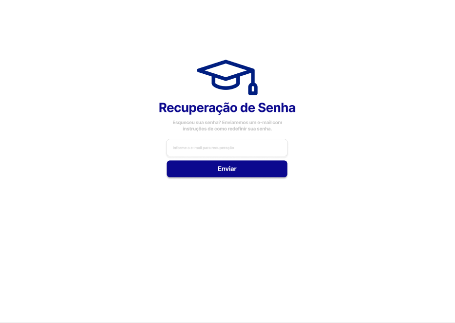

# Projeto de Interface

Dentre as preocupações para a montagem da interface do sistema, estamos estabelecendo foco em questões como agilidade, acessibilidade e usabilidade. Desta forma, o projeto tem uma identidade visual padronizada em todas as telas que são projetadas para funcionamento em desktops e dispositivos móveis levando em consideração as visões do professor e e do aluno para o Sistema de Gestão Acadêmica.  

## User Flow

O fluxo do usuário terá início com a tela de login, onde após a devida autenticação (com e-mail e senha), o mesmo poderá acessar a home page de acordo com o seu perfil, seja ele de aluno ou professor. A home page para ambos os perfis permite a visualização partir de uma barra lateral das opções/funcionalidades disponíveis para cada um. A partir delas o usuário será redirecionado para as telas em que irá realizar as atividades desejadas.

Segue abaixo uma visualização o User Flow baseada no relacionamento da home page e das telas referentes à cada funcionalidade:

## Wireframes

O wireframe pensado leva em consideração as possíveis telas que serão encontradas pelos usuários de acordo com seus perfis e de acordo com as funcionalidades desejadas para o Sistema de Gestão Acadêmica.

### Tela de Login

A tela de login contará com campos para informe das credenciais de acesso, são elas: 

- E-mail
- Senha

### Tela de Recuperação de Senha

Caso o usuário perca ou esqueça a sua senha, o mesmo pode recuperar através da tela de recuperação de senha.

### Tela de Home - Visão Aluno

Após o login bem sucedido o usuário deverá ter seu perfil identificado e caso seja do perfil aluno exibirá a home page abaixo:

 
### Tela de Home - Visão Professor

Após o login bem sucedido o usuário deverá ter seu perfil identificado e caso seja do perfil professor exibirá a home page abaixo:

### Tela para Cadastro de um Novo Aluno

O perfil de professor terá a funcionalidade para cadastrar novos alunos conformes a tela abaixo:

### Tela para Cancelamento de Matrícula

O perfil de professor poderá também realizar o cancelamento de matrículas:

### Tela para Lista de Formandos

O perfil de professor poderá também visualizar todos os alunos que concluíram as turmas ministradas por ele, bem como os respectivos coeficientes de rendimento de cada aluno:

### Tela para Cadastrar Turmas

O perfil de professor poderá também realizar o cadastramento de novas turmas:

### Tela para Matricular Aluno

O perfil de professor poderá também realizar a matrícula de alunos nas turmas ativas em que ele estiver ministrando:

### Tela para Visualizar Turmas

Os perfis de professor e aluno poderão também visualizar as turmas ativas, bem como os detalhes de cada uma:

Será possível também ao perfil de professor realizar a edição das turmas ativas cadastradas por ele:

### Tela para Ativar ou Inativar Turmas

O perfil de professor poderá também inativar as turmas cadastradas, bem como reativar uma turma que outrora foi inativada:

### Tela para Lançar Frequência

O perfil de professor poderá também realizar o lançamento de frequência dos alunos nas turmas em que ele estiver ministrando:

### Tela para Lançar Notas

O perfil de professor poderá também realizar o lançamento das notas, referentes às provas e atividades realizadas pelos alunos, nas turmas em que ele estiver ministrando:

### Tela para Consultar Cadastro

Os perfis de professor e aluno poderão realizar consultas de cadastro de alunos:

### Tela para Consultar Frequência

Os perfis de professor e aluno poderão realizar consultas das frequências de alunos nas turmas ministradas:

### Tela para Emitir Declaração de Matrícula

Os perfis de professor e aluno poderão realizar emissão de declarações de matrícula para os alunos ativos:

### Tela para Consultar Boletim

Os perfis de professor e aluno poderão realizar consultas das notas dos alunos nas turmas ministradas:

### Tela para Emitir Certificado de Conclusão

Os perfis de professor e aluno poderão realizar emissão de certificados de conclusão para os alunos que já obtiveram aprovação nas turmas em que estão matriculados:

## Protótipo

É possível ver com mais detalhes e interagir com o protótipo clicando 
[aqui.](https://www.figma.com/file/xrGiza6A09orfFahLinKxq/Gest%C3%A3o-Acad%C3%AAmica?type=design&node-id=1%3A359&mode=design&t=bIghvnT23bCqUjmg-1) 

