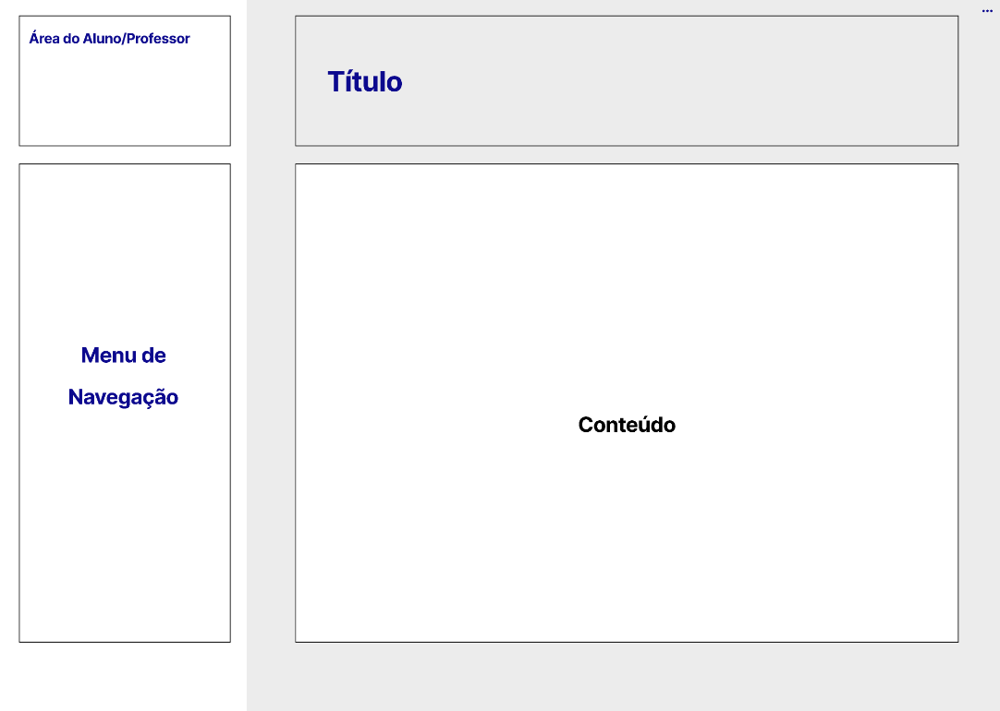
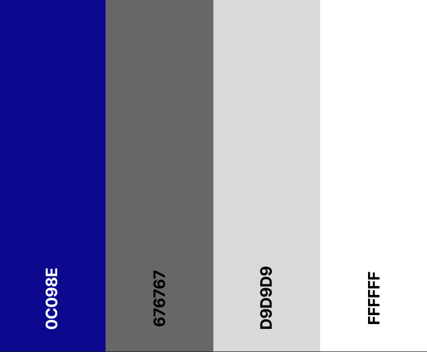

# Template padrão da Aplicação

O layout padrão do site (HTML e CSS) que será utilizado em todas as páginas, em correspondência ao projeto de Interface elaborado anteriormente, conforme imagem abaixo é formado por uma área referente aos perfis de aluno e professor, uma área lateral referente ao menu de navegação, uma área referente ao título da opção a qual o usuário selecionou e uma área para o conteúdo a ser exibido:

A área do aluno e professor apresenta a miniatura da foto do usuário; o título e nome do usuário.

A área do menu de navegação possui uma faixa de opções de acordo com o perfil do usuário logado. As opções são referentes às funcionalidades da aplicação, além de contar com uma opção referente às configurações.

A área do título traz a descrição da funcionalidade selecionada.

A área do conteúdo é preenchida de acordo com a funcionalidade selecionada, onde a mesma pode conter formulários, listas, tabelas e visualizações de documentos.

Para a identidade visual optou-se por um design simples, leve e fluido e a palheta de cores apresentada abaixo:

